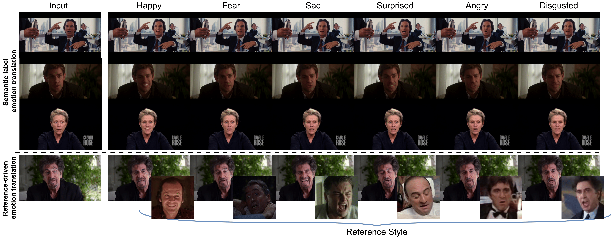

<br>
## <center>Neural Emotion Director: Speech-preserving semantic control of facial expressions in “in-the-wild” videos</center>
### <center><strong>CVPR 2022 Oral (accepted)</strong></center>
#### <center>Foivos Paraperas Papantoniou<sup>1</sup>, Panagiotis P. Filntisis<sup>1</sup>, Petros Maragos<sup>1</sup>, Anastasios Roussos<sup>2,3</sup></center>
<br>
<center>
<sup>1</sup>School of Electrical & Computer Engineering, National Technical University of Athens, Greece<br>
<sup>2</sup>Institute of Computer Science (ICS), Foundation for Research & Technology - Hellas (FORTH), Greece<br>
<sup>3</sup>College of Engineering, Mathematics and Physical Sciences, University of Exeter, UK<br>
</center>
<br>

<blockquote>
<p style='text-align: justify;'>
In this paper, we introduce a novel deep learning method for photo-realistic manipulation of the emotional state of actors in ``in-the-wild'' videos. The proposed method is based on a parametric 3D face representation of the actor in the input scene that offers a reliable disentanglement of the facial identity from the head pose and facial expressions. It then uses a novel deep domain translation framework that alters the facial expressions in a consistent and plausible manner, taking into account their dynamics. Finally, the altered facial expressions are used to photo-realistically manipulate the facial region in the input scene based on an especially-designed neural face renderer. To the best of our knowledge, our method is the first to be capable of controlling the actor’s facial expressions by even using as a sole input the semantic labels of the manipulated emotions, while at the same time preserving the speech-related lip movements. We conduct extensive qualitative and quantitative evaluations and comparisons, which demonstrate the effectiveness of our approach and the especially promising results that we obtain. Our method opens a plethora of new possibilities for useful applications of neural rendering technologies, ranging from movie post-production and video games to photo-realistic affective avatars.
</p>
</blockquote>
 
<br>
<br>
**<center>Overview</center>**
<p style='text-align: justify;'>
Our <em>Neural Emotion Director (NED)</em> can manipulate facial expressions in input videos while preserving speech, conditioned on either the semantic emotional label or on an external reference style as extracted from a reference video.
</p>
<br>
<br>

<p style='text-align: justify;'>
First, we perform 3D facial recovery and alignment on the input frames to obtain the expression parameters of the face. Then, these parameters are translated using our <em>3D-based Emotion Manipulator</em>, where the style vector is computed by either a semantic label (i.e., the emotion), or a driving reference video. Finally, the produced 3D facial shape is concatenated with the Normalized Mean Face Coordinate (NMFC) and eye images and fed into a neural renderer (along with previously computed frames), in order to render the manipulated photo-realistic frames.
</p>
 
 
<br>
<br>
**<center>Links</center>**
<br>
<center>
<a href="https://arxiv.org/pdf/2112.00585.pdf"></a>
<br>
<a href="https://arxiv.org/pdf/2112.00585.pdf">Paper</a>
<br><br>
<a href="https://github.com/foivospar/NED"></a>
<br>
<a href="https://github.com/foivospar/NED">Code</a>
</center>

<br>
<br>
**<center>Demo video</center>**
<center>
For a detailed presentation, check our full demo video.

</center>


<br>
<br>
**<center>Additional results</center>**
<center>
Here, we provide additional results on YouTube videos.
<br>
<br>
Label-guided
<video id="labels" controls width="100%">
<source src="imgs/NED_labels.mp4"	type="video/mp4">
</video>
<br>
<br>
Reference-guided results
<video id="reference" controls width="100%">
<source src="imgs/NED_reference.mp4"	type="video/mp4">
</video>
</center>

<br>
<br>
**<center>Citation</center>**
<br>
```
@article{paraperas2021neural,
         title={Neural Emotion Director: Speech-preserving semantic control of facial expressions in "in-the-wild" videos}, 
         author={Paraperas Papantoniou, Foivos and Filntisis, Panagiotis P. and Maragos, Petros and Roussos, Anastasios},
         journal={arXiv preprint arXiv:2112.00585},
         year={2021}
}
```
